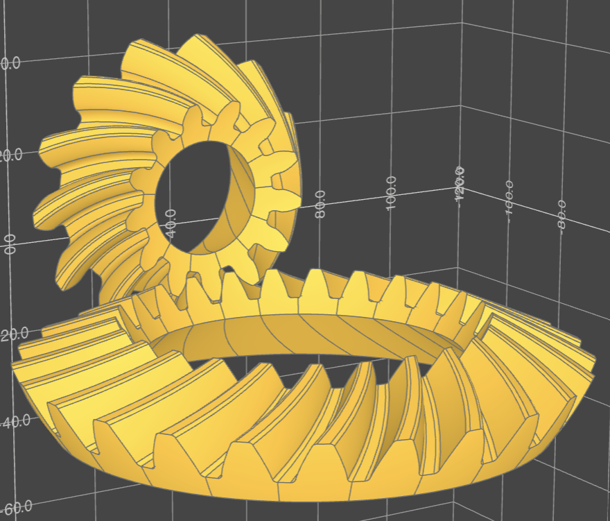

# gggears
A gear generator in python.

# Dependencies
Core geometry generation depends on numpy and scipy only.
Matplotlib is used for testing and displaying results.
CAD model creation uses build123d package, and OCP VSCode addon for displaying models.
See [OCP VSCode github](https://github.com/bernhard-42/vscode-ocp-cad-viewer) and
[build-123d github](https://github.com/gumyr/build123d).

# How to use
Download repo. Get / install dependencies as needed (numpy,scipy, build123d, OCP VSCode).
Follow examples.py.

# Features

Gear generation:
- Spur gears
- Helical / spiral gears
- Bevel gears
- Inside-ring gears
- Profile shift
- Undercut
- Root / tip fillets

Not yet supported:
- Cycloid gears
- Hypoid gears
- Worm gears
- Face / crown gears
- Racks

Planned upcoming other features
- Gear positioning, pairing, assembly
- Planetary drive design
- Design calculations and optimization

# License
Project is licensed under Apache 2.0, see license file for details.