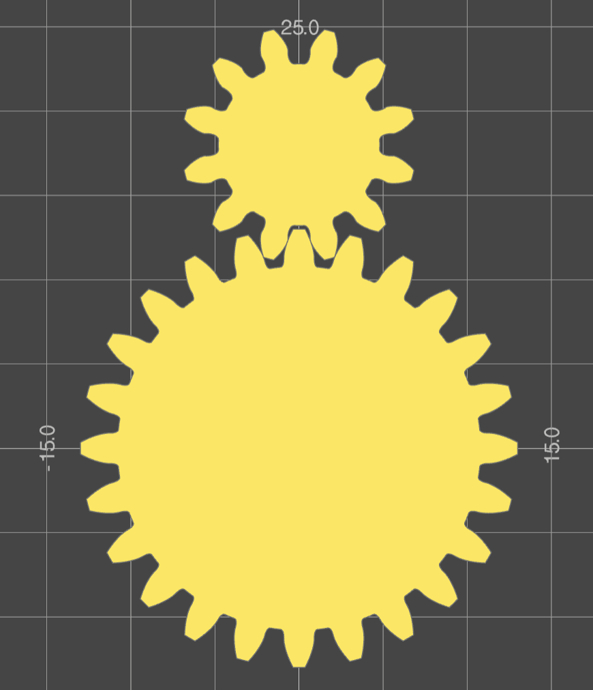

# gggears
A gear generator in python.

# Installation
Currently the recommended way for most users to install gggears is to install from github directly (git is required on the user's system for this):
```
python -m pip install git+https://github.com/GarryBGoode/gggears
```
Alternatively, one can clone or download this repository and install via this command from the repository root directory:
```
python -m pip install .
```
There is an ongoing version-mismatch issue with build123d, ocp-vscode and ocp-cadquery packages. Obtaining dependencies via `pip` might cause problems. If using OCP VSCode for the first time, `quickstart with build123d` might cause problems because it grabs the newest version from build123d github. If build123d is already installed, use the 'package manager' window instead.

For compatibility with dev version of build123d, use gggears branch `CAD_refactor_and_bd_090_compliance`.
Follow [this issue for details.](https://github.com/gumyr/build123d/issues/866)

# Dependencies

Gggears CAD model creation uses build123d package: [build123d github](https://github.com/gumyr/build123d)

It is highly recommended, though not strictly necessary to use a python-CAD gui solution.
See [OCP VSCode](https://github.com/bernhard-42/vscode-ocp-cad-viewer) and [CadQuery Editor](https://github.com/CadQuery/CQ-editor).

# Documentation
Docs hosted on [readthedocs](https://gggears.readthedocs.io/en/latest/)

# Features

Gear generation:
- Spur gears
- Helical / spiral gears
- Bevel gears
- Inside-ring gears
- Profile shift
- Undercut
- Root / tip fillets
- Cycloid gears

Gear positioning and alignment supported.


Work in progress / partially supported:
- Racks

Not yet supported:

- Hypoid gears
- Worm gears
- Face / crown gears

Planned upcoming other features
- Planetary drive design
- Design calculations and parameter optimization

# Example
The example is built on VSCode with OCP VScode plugin.
See `examples.py` for more.
```python
from gggears import *
from ocp_vscode import show, set_port
set_port(3939)

# create 2 spur gears
gear1 = SpurGear(number_of_teeth=12)
gear2 = SpurGear(number_of_teeth=24)

# move and align gear 1 next to gear 2 in the Y direction
gear1.mesh_to(gear2, target_dir=UP)

# generate build123d Part objects
gear_part_1 = gear1.build_part()
gear_part_2 = gear2.build_part()

# visualize parts
show(gear_part_1, gear_part_2)
```



# GUI app
A simple PyQT6 based graphical interface can be used by running gggui.py.

```python .\gui\gggui.py```

This GUI uses OCP vscode for visualization.


# License
Project is licensed under Apache 2.0, see license file for details.
