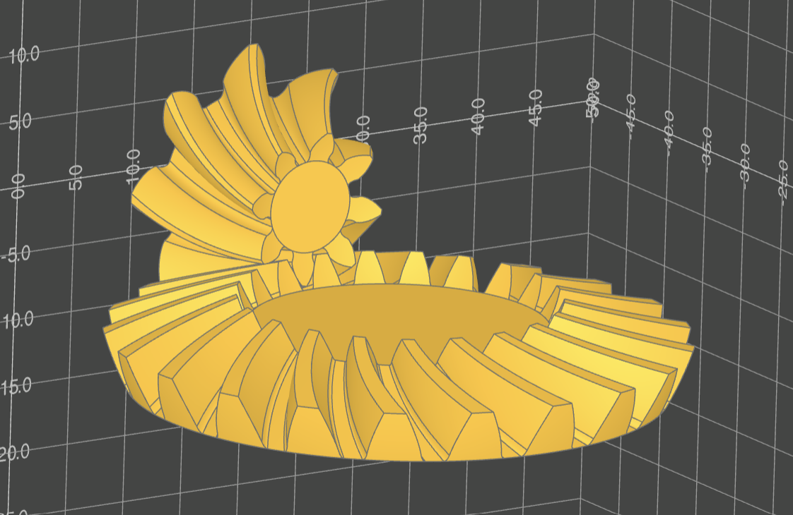

# gggears
A gear generator in python.

# Installation
This project is not yet registered on pypi. You can install it from git via pip:

```pip install git+https://github.com/GarryBGoode/gggears.git@main```

Or download repository and install locally. Navigate to the repository folder and:

```pip install .```

# Dependencies

Gggears CAD model creation uses build123d package: [build-123d github](https://github.com/gumyr/build123d)

It is highly recommended, though not strictly necessary to use a python-CAD gui solution.
See [OCP VSCode](https://github.com/bernhard-42/vscode-ocp-cad-viewer) and [CadQuery Editor](https://github.com/CadQuery/CQ-editor).


# Documentation
Docs hosted on [readthedocs](https://gggears.readthedocs.io/en/latest/)

# Features

Gear generation:
- Spur gears
- Helical / spiral gears
- Bevel gears
- Inside-ring gears
- Profile shift
- Undercut
- Root / tip fillets

Gear positioning and alignment supported.



Not yet supported:
- Cycloid gears
- Hypoid gears
- Worm gears
- Face / crown gears
- Racks

Planned upcoming other features
- Planetary drive design
- Design calculations and parameter optimization

# Example
The example is built on VSCode with OCP VScode plugin.
See `examples.py` for more.
```python
from gggears import *
from ocp_vscode import show, set_port
set_port(3939)

# create 2 spur gears
gear1 = SpurGear(number_of_teeth=12)
gear2 = SpurGear(number_of_teeth=24)

# move and align gear 1 next to gear 2 in the Y direction
gear1.mesh_to(gear2, target_dir=UP)

# generate build123d Part objects
gear_part_1 = gear1.build_part()
gear_part_2 = gear2.build_part()

# visualize parts
show(gear_part_1, gear_part_2)
```


# License
Project is licensed under Apache 2.0, see license file for details.